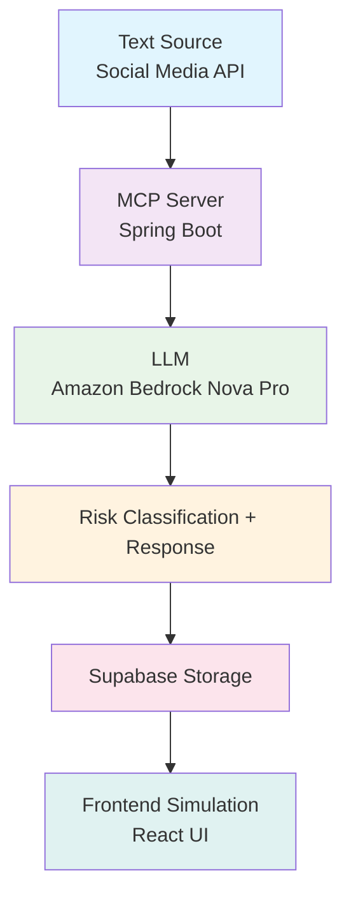

# 🩺 EmpathIA – Emotional Risk Analysis System

<p align="center">
  
</p>

<p align="center">
  <em>"Understanding emotions to save lives."</em><br>
  EmpathIA detects emotional risk through language to promote early mental health intervention.
</p>

---

##  Overview

**EmpathIA** is an **AI analytical system**, not a social network.  
Its purpose is to analyze textual content (e.g., social media posts) in real time to identify **emotional distress signals** and trigger preventive, empathetic actions.  

The small web interface included in this MVP only **simulates a social media environment** to demonstrate the AI’s functionality during evaluation.  
In production, EmpathIA connects directly to real APIs (e.g., Facebook, X, or LinkedIn) to process user posts and provide risk-aware emotional analysis.

>  **Core idea:** Early detection of emotional risk through natural language understanding.

---

##  Project Structure

| Folder | Responsible | Description |
|--------|-------------|-------------|
| `/backend` | **Carlos Salas** | Spring Boot MCP Server, API orchestration, and Bedrock integration |
| `/frontend` | **Zharick Londoño** | React interface (UI simulation), UX flow, and documentation |
| `/llm` | **Santiago Palomino** | LLM configuration, emotional dataset curation, and Supabase integration |

All components communicate via a **custom Model Control Protocol (MCP)** developed with **Spring AI**, ensuring synchronized model orchestration, consistent responses, and auditability.

---

##  Objectives

### General Objective
Design and implement an **AI-driven emotional risk detection ecosystem** that identifies emotional distress patterns in short text and provides early, empathetic interventions.

>  *Helping people before the crisis becomes visible.*

### Specific Objectives
- **Detect** emotional distress and classify it as **low, medium, or high risk**.  
- **Generate** empathetic and context-appropriate responses.  
- **Recommend** supportive actions or professional resources.  
- **Ensure** data ethics and compliance (Law 1581/2012 – Habeas Data, Colombia).  
- **Enable** scalable integration into any existing social network or text-based platform.

---

##  Technologies and Stack

| Layer | Technology | Purpose |
|-------|-------------|----------|
| **Frontend** | React (Next.js + Tailwind) | Simulation interface for emotional post analysis |
| **Backend (MCP Server)** | Spring Boot + Spring AI | Request orchestration, data validation, and agent control |
| **LLM** | Amazon Bedrock (`amazon.nova-pro-v1:0`) | Emotional understanding and response generation |
| **Database** | Supabase (PostgreSQL) | Stores anonymized analysis records and user data |
| **Testing** | JUnit, Jest, Postman | Unit, integration, and LLM validation tests |

---

## Architecture Overview

### System Workflow


## In One Paragraph

EmpathIA processes text through a custom MCP gateway, which routes it to the Amazon Bedrock LLM.
The LLM returns a structured JSON with three key fields: risk_level, response, and recommendation.
The backend validates, filters, and stores the result in Supabase, while the frontend displays it in a simulated post feed.

### Agent Behavior (Single-Agent Model)

EmpathIA now operates under one unified agent, simplifying communication and ensuring consistent behavior.

| Field            | Description                                                      |
| ---------------- | ---------------------------------------------------------------- |
| `risk_level`     | `"low"`, `"medium"`, or `"high"` — detected emotional intensity. |
| `response`       | Short empathetic message tailored to the user’s tone.            |
| `recommendation` | Concrete action or suggestion (e.g., contact a helpline).        |

```json
{
  "risk_level": "high",
  "response": "Lamento que te sientas así, recuerda que no estás solo. Hay ayuda disponible.",
  "recommendation": "Contacta la línea 192 o busca apoyo profesional.",
  "confidence": 0.94
}
```

# Example Integration (Facebook)

When integrated into Facebook:

1. The MCP Server consumes posts from a monitored Page or Feed API.
2. Each post text is analyzed via Bedrock.
3. If a “high risk” is detected:
  - The agent replies empathetically (via Facebook Graph API).
  - A private alert is logged and optionally sent to moderators.
4. Data is anonymized before storage in Supabase.

##  Repository Structure Summary

| Path                | Purpose                                                  |
| ------------------- | -------------------------------------------------------- |
| `emotion-analyzer/` | Frontend (Next.js demo, UI components)                   |
| `mcpServer/`        | MCP gateway and controllers                              |
| `EmpathIA-mcp/`     | Core agent logic and Bedrock adapters                    |
| `EmpathIA-backend/` | Backend utilities and integrations                       |
| `docs/`             | Technical documentation (schemas, architecture, testing) |

## Security, Privacy, and Ethics

All identifiers are hashed or anonymized before persistence.
No medical or diagnostic language is allowed.
The MCP enforces tone validation and content safety filters.
All API keys and credentials are stored securely (e.g., AWS Secrets Manager).
System complies with Habeas Data (Law 1581/2012, Colombia) and GDPR principles.
**Ethical principle:** EmpathIA supports, never diagnoses.

## Roadmap

| Phase                  | Focus                               | Deliverable                     |
| ---------------------- | ----------------------------------- | ------------------------------- |
|  MVP (Hackathon 2025) | Emotion detection prototype         | LLM integration + UI simulation |
|  Q1 2026             | External API connector (Facebook/X) | Social media ingestion          |
|  Q2 2026             | Enhanced empathy tuning             | LLM fine-tuning                 |
|  Q3 2026             | Multi-agent extensions              | Contextual collaboration        |
|  Q4 2026             | Real pilot test                     | Large-scale emotional analytics |

## Team

| Member                | Role              | Focus Area              |
| --------------------- | ----------------- | ----------------------- |
| **Carlos Salas**      | Backend Engineer  | MCP, APIs, Data Routing |
| **Zharick Londoño**   | Frontend Engineer | UI/UX, Documentation    |
| **Santiago Palomino** | AI Specialist     | LLM, Dataset, Supabase  |

## Quick Start

### Frontend

```powershell
cd .\emotion-analyzer
pnpm install
pnpm dev
```

### Backend (MCP Server)

```powershell
cd .\mcpServer\mcpServer
.\gradlew.bat bootRun
```

# Final Notes for Evaluators

- EmpathIA is not a social network, but an analytical AI engine simulating social media for demo purposes.

- Evaluation should focus on:

      - LLM consistency (risk_level, response, recommendation)
      - Ethical compliance and non-diagnostic tone
      - Integration readiness (API, Bedrock, Supabase)
      - Documentation completeness and logical structure

For prompt schemas and example payloads, see docs/AGENT_DESIGN.md

<p align="center"> <strong>EmpathIA – Technology with Human Purpose.</strong><br> <em>More than AI, a companion for emotional well-being.</em> </p> ```